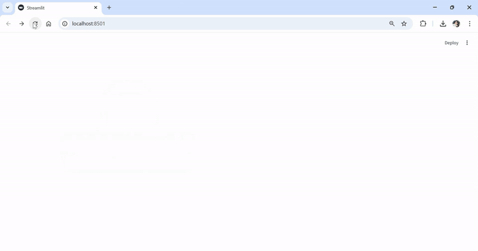
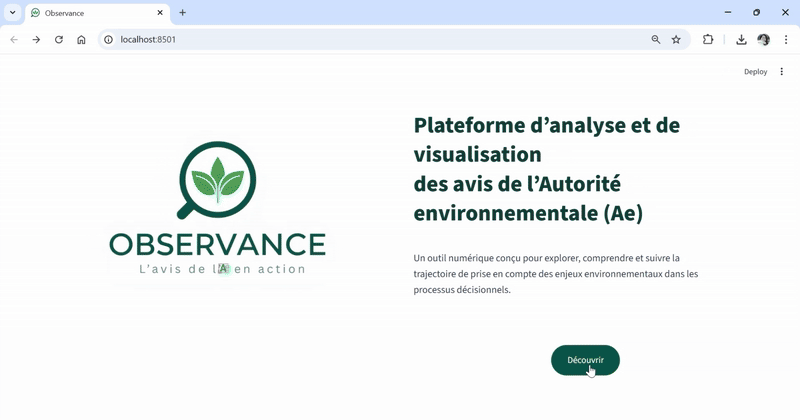
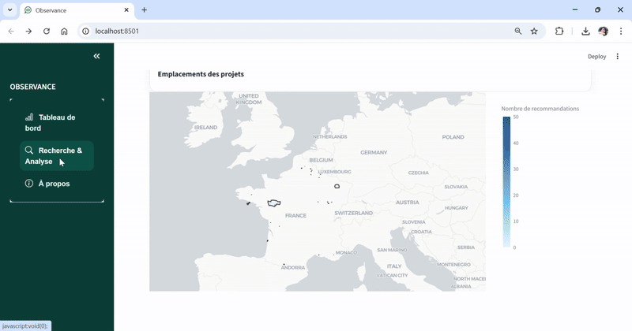
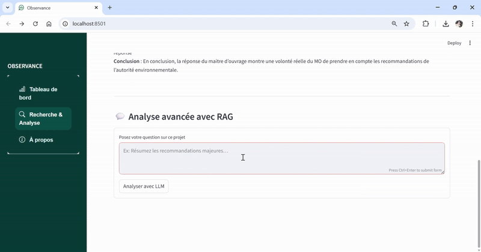

# OBSERVANCE  

## 🧭 Contexte  
Les Autorités environnementales (Ae et MRAe) publient chaque année plusieurs milliers d’avis afin d’évaluer la prise en compte des enjeux environnementaux dans les projets, plans et programmes.  
Bien que non contraignantes, ces recommandations constituent un **indicateur clé de la maturité environnementale** des projets, dont le suivi reste complexe à grande échelle.

## ❗ Problématiques  
- Documents dispersés entre plusieurs sources et formats hétérogènes  
- Analyses manuelles chronophages et peu reproductibles  
- Difficulté à suivre la prise en compte effective des recommandations  
- Vision limitée des dynamiques territoriales et sectorielles  

## 💡 Solution  

  

**OBSERVANCE** est une plateforme numérique qui centralise et analyse les avis de l’Ae et les mémoires en réponse grâce à :  
- une base de données unifiée,  
- des scripts d’extraction automatisés,  
- des techniques de NLP et un module RAG.  

Elle permet d’identifier les tendances, d’évaluer la prise en compte des recommandations et de comparer les dynamiques entre territoires.

## 📊 Résultats  
- ⏱️ Réduction d’environ **90 % du temps d’analyse** par rapport à un traitement manuel  
- 🔍 Suivi automatisé de la prise en compte des recommandations  
- 📈 Visibilité immédiate sur les recommandations réellement appliquées  
- 🧠 Support direct à la décision pour l’analyse et l’ajustement des politiques publiques  

## Stack technique

| Domaine | Outils / librairies |
|----------|---------------------|
| Extraction & OCR | `pdfplumber`, `pytesseract`, `Regex` |
| NLP & Vectorisation | `LangChain`, `HuggingFace`, `ChromaDB`, `FTS5` |
| LLM | `Ollama` |
| Frontend | `Streamlit`, `Plotly` |
| Base de données | `SQLite` |
| Déploiement | `Docker`, `Google Cloud VM` |

## Captures d’écran

### Page d’accueil

  

### Tableau de bord

  

  

### Recherche et Analyse

  

### Analyse avec RAG

  

## Licence  
MIT — libre de réutilisation avec attribution.

---

## English summary  
**OBSERVANCE** is a data-driven platform using NLP and vector databases to analyze environmental authority opinions (Ae) in France. 
It provides interactive dashboards, semantic search, and RAG-powered AI analysis to support environmental governance research and decision-making.
