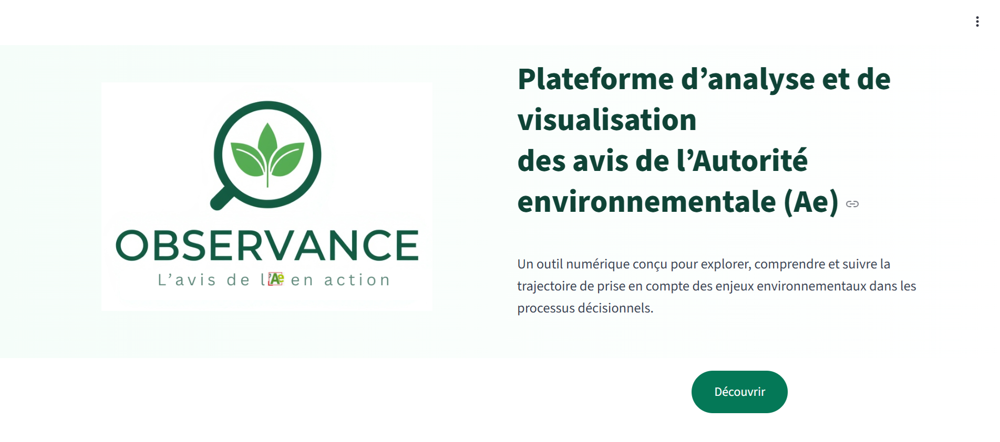

# 🧭 OBSERVANCE  
**Plateforme d’analyse et de visualisation des avis de l’Autorité environnementale (Ae)**  

  

> Outil numérique conçu pour étudier la manière dont les avis de l'**Autorité environnementale (Ae)** sont intégrés dans le processus décisionnel, notamment à travers les **mémoires en réponse** des maîtres d’ouvrage.

---

## ⚙️ Stack technique

| Domaine | Outils / librairies |
|----------|---------------------|
| Extraction & OCR | `pdfplumber`, `pytesseract`, `Regex` |
| NLP & Vectorisation | `LangChain`, `HuggingFace`, `ChromaDB`, `FTS5` |
| LLM | `Ollama` |
| Frontend | `Streamlit`, `Plotly` |
| Base de données | `SQLite` |
| Déploiement | `Docker`, `Google Cloud VM` |

---

## 🚀 Fonctionnalités principales

- 📊 **Tableau de bord interactif** : indicateurs, cartes, statistiques.  
- 🔍 **Recherche plein texte et sémantique** dans les avis et réponses.  
- 💬 **Analyse avancée via RAG** : analyse documentaire assistée par l'IA.  
- 🗂️ **Exploration détaillée des projets** et métadonnées associées.

---

## 🖼️ Captures d’écran

### 🏠 Page d’accueil

  

### 📊 Tableau de bord

  

### 🗺️ Carte et projets

  

### 🔍 Recherche et Analyse

  

### 🤖 Analyse avec RAG

  

---

## 👉 Application accessible sur 

  

---
## 🪴 Licence  
MIT — libre de réutilisation avec attribution.

---

## 🌍 English summary  
**OBSERVANCE** is a data-driven platform using NLP and vector databases to analyze environmental authority opinions (Ae) in France.  
It provides interactive dashboards, semantic search, and RAG-powered AI analysis to support environmental governance research and decision-making.
 des avis de l’Autorité environnementale (Ae)**  
